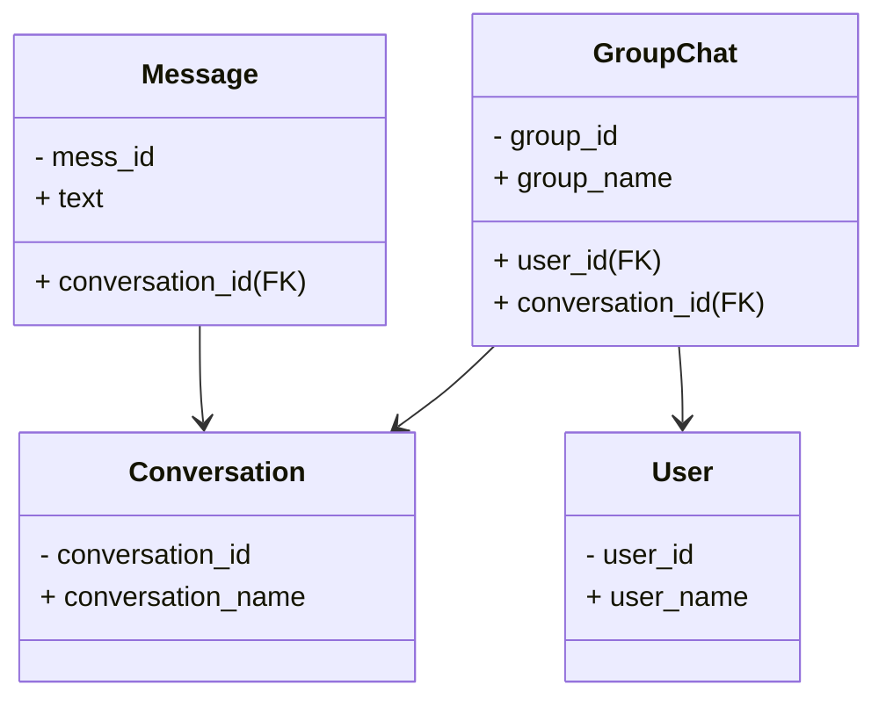

Tại phần này sẽ hướng dẫn về các hoạt động realtime trong hệ thống e-commerce:
- Gửi tin nhắn
- Online/Offline
- Nhận thông báo

Trước khi hướng dẫn sẽ biểu diễn cơ sở dữ liệu trong các bảng dùng để lưu như sau:
```mysql
CREATE TABLE `User` (
	`user_id` VARCHAR(18) NOT NULL COLLATE 'utf8mb4_0900_ai_ci',
	`user_name` VARCHAR(100) NOT NULL COLLATE 'utf8mb4_0900_ai_ci',
	`date_of_birth` DATE NULL DEFAULT NULL,
	`address` VARCHAR(255) NULL DEFAULT NULL COLLATE 'utf8mb4_0900_ai_ci',
	`phone_num` VARCHAR(10) NULL DEFAULT NULL COLLATE 'utf8mb4_0900_ai_ci',
	`email` VARCHAR(100) NULL DEFAULT NULL COLLATE 'utf8mb4_0900_ai_ci',
	`pass_word` VARCHAR(255) NULL DEFAULT NULL COLLATE 'utf8mb4_0900_ai_ci',
	`is_block` TINYINT(1) NULL DEFAULT '0',
	`is_delete` TINYINT(1) NULL DEFAULT '0',
	PRIMARY KEY (`user_id`) USING BTREE,
	UNIQUE INDEX `phone_num` (`phone_num`) USING BTREE,
	UNIQUE INDEX `email` (`email`) USING BTREE,
	INDEX `idx_user_name` (`user_name`) USING BTREE,
	INDEX `idx_phone_num` (`phone_num`) USING BTREE,
	INDEX `idx_email` (`email`) USING BTREE
)
COLLATE='utf8mb4_0900_ai_ci'
ENGINE=InnoDB
;

CREATE TABLE `Conversation` (
	`conversation_id` INT(10) NOT NULL AUTO_INCREMENT,
	`conversation_name` VARCHAR(100) NOT NULL COLLATE 'utf8mb4_0900_ai_ci',
	PRIMARY KEY (`conversation_id`) USING BTREE
)
COLLATE='utf8mb4_0900_ai_ci'
ENGINE=InnoDB
AUTO_INCREMENT=7
;

CREATE TABLE `Message` (
	`mess_id` VARCHAR(18) NOT NULL COLLATE 'utf8mb4_0900_ai_ci',
	`text` VARCHAR(255) NOT NULL COLLATE 'utf8mb4_0900_ai_ci',
	`send_date` DATETIME NULL DEFAULT 'CURRENT_TIMESTAMP' ON UPDATE CURRENT_TIMESTAMP,
	`from_number` VARCHAR(18) NOT NULL COLLATE 'utf8mb4_0900_ai_ci',
	`conversation_id` INT(10) NOT NULL,
	PRIMARY KEY (`mess_id`) USING BTREE,
	INDEX `conversation_id` (`conversation_id`) USING BTREE,
	CONSTRAINT `Message_ibfk_1` FOREIGN KEY (`conversation_id`) REFERENCES `Conversation` (`conversation_id`) ON UPDATE CASCADE ON DELETE CASCADE
)
COLLATE='utf8mb4_0900_ai_ci'
ENGINE=InnoDB
;

CREATE TABLE `GroupChat` (
	`group_id` INT(10) NOT NULL AUTO_INCREMENT,
	`group_name` VARCHAR(100) NOT NULL COLLATE 'utf8mb4_0900_ai_ci',
	`is_group` TINYINT(1) NULL DEFAULT '0',
	`join_date` DATETIME NULL DEFAULT 'CURRENT_TIMESTAMP',
	`user_id` VARCHAR(18) NOT NULL COLLATE 'utf8mb4_0900_ai_ci',
	`conversation_id` INT(10) NOT NULL,
	PRIMARY KEY (`group_id`) USING BTREE,
	UNIQUE INDEX `uk_User_Conversation` (`conversation_id`, `user_id`) USING BTREE,
	INDEX `user_id` (`user_id`) USING BTREE,
	INDEX `idx_groupchat_id` (`group_id`) USING BTREE,
	CONSTRAINT `FK_Conversation_groupChat` FOREIGN KEY (`conversation_id`) REFERENCES `Conversation` (`conversation_id`) ON UPDATE CASCADE ON DELETE CASCADE,
	CONSTRAINT `GroupChat_ibfk_1` FOREIGN KEY (`user_id`) REFERENCES `User` (`user_id`) ON UPDATE CASCADE ON DELETE CASCADE
)
COLLATE='utf8mb4_0900_ai_ci'
ENGINE=InnoDB
AUTO_INCREMENT=9
;
```

Đồ thị:


Cài đặt thư viện:
```shell
Install-Package Microsoft.AspNetCore.SignalR
```

Cấu hình kết nối đến CSDL mysql, trong file appsettings.json:
```json
  "Database":{
    "MySQL": "Server=localhost; Port=3306; Database=E_commerce; Uid=root; Pwd=xxxxx000111; Connection Timeout=60; DefaultCommandTimeout=300; AllowLoadLocalInfile=true; Pooling=true; Min Pool Size=10; Max Pool Size=100; ConnectionLifeTime=600; ConnectionReset=true; UseCompression=true; AllowUserVariables=true; AutoEnlist=false;",
  }
```


Tạo lớp `DatabaseConnectionFactory`, lớp này có trách nhiệm cho việc kết nối đến csdl:

```csharp
using System.Data;
using System.Threading;
using E_commerce.Application.Application;
using Microsoft.Extensions.Configuration;
using MySqlConnector;

namespace E_commerce.Infrastructure.Data
{
    public class DatabaseConnectionFactory
    {
        private readonly string _connectionString;  
        private readonly ILogger _logger;
        private readonly int _retryCount = 3;  
        private readonly int _retryDelayMs = 500;  
        
        private static readonly HashSet<int> RetryableErrorCode = new HashSet<int>{
            1042,   // Không thể kết nối đến mấy kỳ máy chủ MySQL nào được chỉ định
            1043,   // Bắt tay tệ
            1045,   // Tài khoản không có quyền truy cập vào máy chủ MySQL
            1153,   // Packet quá lớn
            1158,   // Lỗi đọc packet
            1159,   // Timeout đọc packet
            2002,   // Không thể kết nối đến máy chủ MySQL
            2003,   // Không thể kết nối đến máy chủ MySQL
            2004,   // Không thể kết nối đến máy chủ MySQL
            2005,   // Máy chủ MySQL không xác đinh
            2006,   // Server đã ngắt kết nối
            2013    // Mất kết nối trong quá trình truy vấn
        };

        //Hàm khởi tạo
        public DatabaseConnectionFactory(
        IConfiguration configuration, ILogger logger){
            _connectionString = configuration["Database:MySQL"] ??
                throw new InvalidOperationException
	                ("Connection string 'Database:MySQL' is not configured");
            _logger = logger
                ?? throw new ArgumentNullException(nameof(logger));
        }


        /// <summary>
        /// Tạo kết nối với database với cơ chế retry
        /// </summary>
        public IDbConnection CreateConnection(){
            for(int i = 0; i < _retryCount; i++){
                try{
                    var connection = new MySqlConnection(_connectionString);
                    
                    if(connection.State != ConnectionState.Open)
                        connection.Open();

                    return connection;
                }

                catch(MySqlException ex)
                {
                    //Chỉ retry lỗi kết nối, không retry với lỗi cú pháp
                    bool shouldRetry = ex is MySqlException mySqlException && 
	                    RetryableErrorCode.Contains(mySqlException.Number);

                    if( i == _retryCount - 1 || shouldRetry){
                        _logger.Error($"Database connection failed after {i+1} attempts: {ex.Message}", ex);
                        throw new InvalidOperationException
	                        ("Database connection failed", ex);
                    }

                    _logger.Warn($"Database connection attempt {i+1} failed: {ex.Message}. Retrying in {_retryDelayMs}ms...");

                    Thread.Sleep(_retryDelayMs);
                }
            }

            //Nếu không thành công sau số lần retry
            throw new TimeoutException
	            ($"Failed to connection to Database after {_retryCount} attempts");
        }

        ///<summary>
        /// Tạo kết nối đến database với cơ chế retry (async)
        ///</summary>
        public async Task<IDbConnection> CreateConnectionAsync(){
             for(int i = 0; i < _retryCount; i++){
                try{
                    var connection = new MySqlConnection(_connectionString);
                    if(connection.State != ConnectionState.Open)
                        await connection.OpenAsync();

                    return connection;
                }

                catch(MySqlException ex)
                {
                    //Chỉ retry lỗi kết nối, không retry với lỗi cú pháp
                    bool shouldRetry = ex is MySqlException mySqlException && 
	                    RetryableErrorCode.Contains(mySqlException.Number);

  

                    if( i == _retryCount - 1 || shouldRetry){

                        _logger.Error($"Database connection failed after {i+1} attempts: {ex.Message}", ex);

                        throw new InvalidOperationException("Database connection failed", ex);

                    }

  

                    _logger.Warn($"Database connection attempt {i+1} failed: {ex.Message}. Retrying in {_retryDelayMs}ms...");

                    await Task.Delay(_retryDelayMs);

                }

            }

            //Nếu không thành công sau số lần retry

            throw new TimeoutException($"Failed to connection to Database after {_retryCount} attempts");

        }

  

        /// <summary>

        /// Kiểm tra kết nối đến database có hợp lệ hay không

        /// .Nếu kết nối không hợp lệ thì sẽ trả về false

        /// </summary>

        public bool ValidateConnection(IDbConnection connection){

            if(connection == null || connection.State != ConnectionState.Open)

                return false;

            try{

                using(var cmd = connection.CreateCommand()){

                    cmd.CommandText = "SELECT 1";

                    cmd.CommandTimeout = 5; // 5 giây timeout

                    return cmd.ExecuteScalar() != null;

                }

            }catch(Exception ex){

                 _logger.Error($"Connection validation failed: {ex.Message}", ex);

                return false;

            }

        }

  

        /// <summary>

        /// Khởi động pool kết nối với số lượng kết nối tối thiểu

        /// </summary>

        public void WarmupConnectionPool(){

            try{

                List<IDbConnection> connections = new List<IDbConnection>();

                int minPoolSize = 10;   //Đồng bộ với MinPoolSize

  

                _logger.Info($"Warming up connection pool with {minPoolSize} connections...");

  

                //Tạo kết nối để làm đầy pool

                for(int i = 0; i < minPoolSize; i++){

                    var connection = CreateConnection();

                    connections.Add(connection);

                }

  

                _logger.Info($"Successfully established {connections.Count} initial connections");

  

                //Trả lại kết nối cho pool

                foreach( var connection in connections){

                    connection.Dispose();

                }

            }

            catch(Exception ex){

                _logger.Error($"Error warming up connection pool: {ex.Message}", ex);

            }

        }

    }

}
```

Thiết lập các câu lệnh như sau, tại file program:
- Đăng ký dịch vụ:
- Thiết lập kết nối


