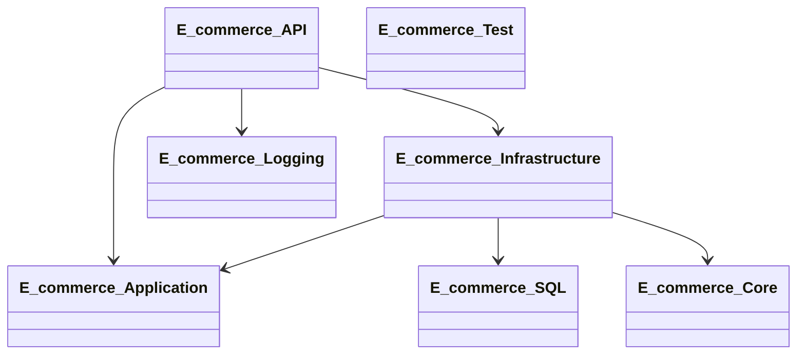

##### **DBScripts**

---
##### **E_commerce.Application**

Project này tham chiếu đến Layer core.
Project này chứa các thư mục:
- **Application**: Định nghĩa Interface để cho lớp khác dựa vào để thực hiện.

---
##### **E_commerce.Core**

Tại **layer Core** này không phụ thuộc vào bất cứ **Project** hoặc **layer** nào. Vì đây là điều rất quan trong trong kiến trúc "Clean Architecture".
Project này chứa các thư mục:
- **Entites**: Định nghĩa thuộc tính cho từng lớp. Để biểu diễn business concepts/rules. (Chỉ có các thuộc tính cơ bản). Tại đây thì các Entites sẽ độc lập không phụ thuộc vào bất kỳ layer nào khác.
- **Exception**: Thư mục này chứa lớp trừu tượng ECommerceException để phân loại lỗi.

---
##### **E_commerce.Test**

Project kiểm thử được tạo với MSTest

---
##### **E_commerce.Logging**

Project này tham chiếu đến **project Application**

---
##### **E_commerce.SQL**

Project này để quản lý các câu truy vấn **Dapper**
- Tạo thư mục **Queries** để chứa các lớp định dạng câu truy vấn của từng đối tượng.
- Tạo thư mục **Script** được thêm vào để chứa các tập lệnh tiên quyết của bảng sử dụng trong mẫu.
- 

---
##### **E_commerce.Infrastructure**

Project này **tham chiếu đến** các project: **E_commerce.Application, E_commerce.Core , E_commerce.SQL**

Thư mục trong project này:
- **Repository**: thư mục này để triển khai các giao diện từ **E_commerce.Application**
- **Data**: Thư mục này chứa mọi thứ liên quan đến Database
	- **Data/Models:** Chứa các model được scaffold từ DB. Để ánh xạ với cấu trúc Database (Có thêm các thuộc tính quan hệ & phụ thuộc vào EF Core và các Model khác). Được tập trung vào cách lưu trữ và truy xuất dữ liệu
	- **RateLimiting**: Thư mục này mục đích chính là quản lý RateLimiting dựa trên trạng thái người dùng và đã được custom. 

---
#### **E_commerce.API**

project này sẽ tham chiếu đến **E_commerce.Infrastructure, E_commerce.Application, E_commerce.Logging**
Project này sẽ được thiết lập các cấu hình kết nối trong file `appsettings,json` .
Thư mục trong project này:
- **Model**: Để quản lý định dạng phản hồi chung cho APIs.
- **Controller**:  Dùng để triển khai xác thực.
- **Middleware**: Thư mục này chứa những middleware đã được custom lại.

---
##### **test**

---
Sơ đồ:

---

Cần thực hiện

| Cần phải có                          |     |
| ------------------------------------ | --- |
| Chạy được                            |     |
| Authen & Author                      |     |
| AccessToken & RefreshToken           |     |
| Gửi AccessToken qua cookie           |     |
| Xác thực qua email khi quên mật khẩu |     |
| Phân trang                           |     |
| LINQ                                 |     |
| OTP+redis                            |     |
| RabbitMQ                             |     |
| Kafka                                |     |
| Docker                               |     |
| Socket                               |     |
| ChatBot                              |     |
|                                      |     |
|                                      |     |
| Giao diện                            |     |
