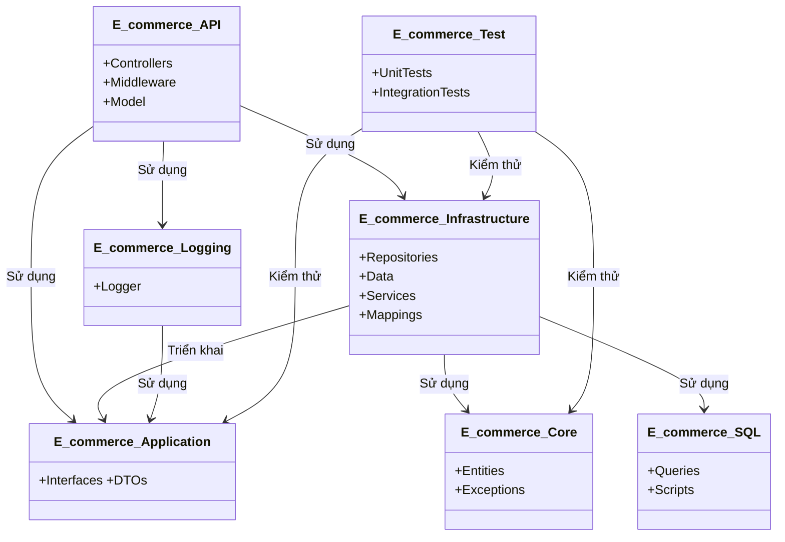

Dự án **E_commerce** là một hệ thống thương mại điện tử được xây dựng dựa trên kiến trúc **Clean Architecture**, nhằm đảm bảo mã nguồn dễ bảo trì, mở rộng và kiểm thử. Dự án sử dụng **.NET Core** cho **backend**

---
### **Clean Architecture Overview**

Clean Architecture là một kiến trúc phần mềm tập trung vào việc tách biệt các mối quan tâm (Separation of Concerns) và đảm bảo tính độc lập của các tầng (layer). Trong dự án này:

- **Core layer (E_commerce.Core):** Tại tầng này sẽ chứa các logic nghiệp vụ, không phụ thuộc vào bất kỳ tầng nào khác
- **Application Layer (E_commerce.Application):** Tầng này định nghĩa giao diện (**Interface**) và DTO để điều phối logic nghiệp vụ
- **Infrastructure layer (E_commerce.Infrastructure):** Triển khai các giao diện từ *Application Layer*, xử lý truy cập dữ liệu và tích hợp bên ngoài (Redis, RabbitMQ,...)
- **API layer (E_commerce.API):** Tầng giao tiếp với client, chứa các API endpoint và middleware

***Nguyên tắc chính của Clean Architecture được áp dụng:***
- **Dependency rule**: các tẩng bên trong (Core, Application) không phụ thuộc vào các tầng bên ngoài (Infrastructure, API)
- **Tách biệt logic nghiệp vụ:** Logic nghiệp vụ được đặt ở Core layer, không bị ảnh hưởng bởi các công nghệ cụ thể (như Database, Framework).

---
### **Cấu trúc dự án**

##### 1. **E_commerce.Core (Tầng Domain):**
- **Mục đích:** Định nghĩa các thực thể nghiệp vụ và ngoại lệ, không phụ thuộc vào bất kỳ tầng nào bên ngoài
- **Thư mục:**
	- `Entities`: Các đối tượng nghiệp vụ như: `_User`, `Role`, `Rank`,...
	- `Exceptions:`  Lớp ngoại lệ tùy chỉnh `ECommerceException` để xử lý lỗi thống nhất
- **Nguyên tắc chính:** tầng này ở trung tâm hệ thống nên hoàn toàn độc lập.

##### 2. **E_commerce.Application (Tầng Application):**
- **Mục đích:** Định nghĩa giao diện hoạt động của nghiệp vụ (như giao diện repository) và các đối tượng truyền dữ liệu  (DTO) để giao tiếp giữa các tầng.
- **Thư mục:**
	- `Application`: Các giao diện như: `IUserRepository`, `IRoleRepository`,... để trừu tượng hóa truy cập dữ liệu và logic nghiệp vụ.
	- `DTOs`: Cấu trúc dữ liệu cho yêu cầu, phản hồi và mô hình chung
 - **Phụ thuộc:** Chỉ phụ thuộc vào `E_commerce.Core` để truy cập thực thể và ngoại lệ.
##### 3. **E_commerce.Infrastructure (Tằng Infrastructure):**
- **Mục đích:** Triển khai giao diện từ `Application` và xử lý các hệ thống bên ngoài như cơ sở dữ liệu, Redis, Oauth,...
- **Thư mục:**
	- `Data`: Mã liên quan đến cơ sở dữ liệu. 
	- `Models`: Các mô hình EF Core (như `Bill`, `Customer`, `User`) ánh xạ với bảng cơ sở dữ liệu. Khác với `Core/Entities`, chúng có thuộc tính quan hệ và thuộc tính dành riêng cho database. 
	- `ApplicationDbContext`: Ngữ cảnh EF Core cho thao tác cơ sở dữ liệu. 
	- `Repositories`: Triển khai các giao diện từ `Application` (như `UserRepository`, `CustomerRepository`). 
	- `Services`: Tích hợp dịch vụ bên ngoài. - `impl`: Các dịch vụ cụ thể như `TokenService` (cho JWT), `RedisServices` (cho OTP), `GoogleServiceAuthentication` (cho OAuth). 
	- Giao diện như `ITokenService`, `IRedisServices`. 
	- `Mappings`: Các cấu hình AutoMapper (như `UserMappingProfile`) để ánh xạ giữa thực thể, DTO và mô hình database. 
	- `Configurations`: Cấu hình cơ sở dữ liệu và dịch vụ. 
	- `Utils`: Lớp hỗ trợ như `CodeGenerator` (tạo OTP) và `CheckoForDuplicateErrors` (kiểm tra trùng lặp). 
	- `Constants`: Hằng số mã lỗi (như `MysqlExceptionsConstants`). 
	- `Monitoring`: Công cụ như `ConnectionPoolMonitor` để theo dõi hiệu suất cơ sở dữ liệu. 
- **Phụ thuộc**: Phụ thuộc vào `E_commerce.Core`, `E_commerce.Application` và `E_commerce.SQL`, `E_commerce.Logging`

##### 4. **E_commerce.API (Tằng Presentation):**
- **Mục đích:** Cung cấp các endpoint RESTful để tương tác với hệ thống và xử lý yêu cầu/phản hồi HTTP.
- **Thư mục:**
	- `Controllers`: Các endpoint API (như `AhthController` cho đăng nhập, `UserController` quản lý các thông tin liên quan đến người dùng,... )
	- `Model`: Định dạng các phản hồi API chuẩn hóa (`ApiResponse` ).
	- `Middleware`: Middleware tùy chỉnh như `ExeptionHandlingMiddleware` để xử lý lỗi.
	- `Filter`: Bộ lọc tùy chỉnh che xác thực hoặc kiểm tra yêu cầu
	- `Properties`: Tệp cấu hình (`appsettings.json`, `launchSettings.json` )
- **Cấu hình:** Sử dụng `appsettings.json` cho kết nối CSDL, thiết lập JWT, Redis, v.v
- **Phụ thuộc:** vào `E_commerce.Infrastructure`, `E_commerce.Application` và `E_commerce.Logging`.

##### 5.  **E_commerce.SQL:**
- **Mục đích:** Quản lý truy vấn CSDL bằng Dapper để đạt hiệu suất cao.
- **Thư mục:** 
	- `Queries:` Chứa các lớp truy vấn (như `UserQueries`, `CustomerQueries`), cho thao tác CRUD.
	- `Script:` tập SQL để thiết lập CSDL (như tạo bảng).

##### 6.  **E_commerce.Logging:**
- **Mục đích:** Cung cấp ghi log tập trung bằng `log4net` để hỗ trợ gỡ lỗi và theo dõi
- **Tệp:**  `Logger.cs` cho triển khai ghi log, `LoggerConfig.xml` cho cấu hình.
- **Phụ thuộc**: Phụ thuộc vào `E_commerce.Application` cho giao diện ghi log.

##### 7.  **E_commerce.Test:**
- **Mục đích:** Chứa các bài kiểm tra thử đơn vị và tích hợp để đảm bảo chất lượng mã. 
- **Thư mục**: 
	- `IntegrationTests`: Kiểm thử cho endpoint API (như `RoleControllerShould`). 
	- `Helper`: Công cụ hỗ trợ kiểm thử. 
- **Phụ thuộc**: Sử dụng MSTest, phụ thuộc vào `E_commerce.Core`, `E_commerce.Application` và `E_commerce.Infrastructure`.

##### 8.  **DBScripts:**
- **Mục đích**: Lưu trữ các tệp khởi tạo cơ sở dữ liệu.
- **Tệp**: `MySQL.sql` để tạo bảng và dữ liệu mẫu.

---
#### ***Sơ đồ phụ thuộc:***

---

Dự tính áp dụng

| Cần phải có                          |     |
| ------------------------------------ | --- |
| Chạy được                            |     |
| Authen & Author                      |     |
| AccessToken & RefreshToken           |     |
| Gửi AccessToken qua cookie           |     |
| Xác thực qua email khi quên mật khẩu |     |
| Phân trang                           |     |
| LINQ                                 |     |
| OTP+redis                            |     |
| RabbitMQ                             |     |
| Kafka                                |     |
| Docker                               |     |
| Socket                               |     |
| ChatBot                              |     |
|                                      |     |
|                                      |     |
| Giao diện                            |     |
